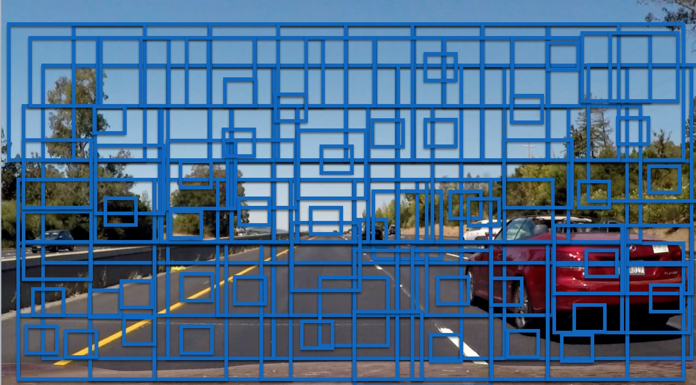

# Vehicle & Lane Detection

In this project aims to develop a software pipeline to detect vehicles in a video and using advanced techniques such as Support Vector Machines (SVM), Decision Tree with the help of tools like Spatial Binning, Histogram of Oriented Gradient ([HOG](http://lear.inrialpes.fr/people/triggs/pubs/Dalal-cvpr05.pdf)) etc.


The Project
---

The goals / steps of this project are the following:

* Perform a Histogram of Oriented Gradients (HOG) feature extraction on a labeled training set of images and train a classifier Linear SVM classifier
* Optionally, you can also apply a color transform and append binned color features, as well as histograms of color, to your HOG feature vector. 
* Note: for those first two steps don't forget to normalize your features and randomize a selection for training and testing.
* Implement a sliding-window technique and use your trained classifier to search for vehicles in images.
* Run your pipeline on a video stream (start with the test_video.mp4 and later implement on full project_video.mp4) and create a heat map of recurring detections frame by frame to reject outliers and follow detected vehicles.
* Estimate a bounding box for vehicles detected.

### Project Files
> * `line.py` -- from project 4
> 
> * `lane_finder.py` -- from project 4
> 
> * `lane_detection.py` -- from project 4
> 
> * `Vehicle-Detection.ipynb` -- Jupyter Notebook, partly includes Project 4
> 
> * Folder `vehicles` -- Not checked in, need to be included for training 
> 
> * Folder `non-vehicles` -- Not checked in, need to be included for training 
> 
> * `project_output.mp4`  -- Project 5 output video
> 
> * `project_output_wLaneDetect.mp4` -- Lane Detection & Vehicle Detection combined
> 


# Histogram of Oriented Gradients
--

#### 1. Explain how (and identify where in your code) you extracted HOG features from the training images.

The function `get_hog_features` from the coursework, retrieves the HOG features by using `skimage.feature.hog` which computes gradient of the given image in `x` and `y` and obtains gradient histograms, then normalizes the blocks and returns a flattened feature vector.

The Cell underneath the heading **HOG Playground** in the Jupyter Notebook helps play with different color-spaces and tweak the below listed parameters.

```
orient = 7
hist_bins = 32
hog_channel = 0
pix_per_cell = 8
cell_per_block = 2
spatial_size = (32, 32)

hog_feat = True
hist_feat = True
spatial_feat = True

color_space = 'LUV'

```

Below are the images object by keeping all the above paramters and only varing the color spaces.

* RGB


* HLS


* HSV


* LUV


* YCrCb


#### 2. Explain how you settled on your final choice of HOG parameters.

From looking at the above images it is easier to exclude HLS and HSV color spaces, with a very close look we can also exclude RGB.  From the images LUV seems to be slightly better than YCrCb, considering both these color spaces for further exploration.


#### 3. Describe how (and identify where in your code) you trained a classifier using your selected HOG features (and color features if you used them). 

From the notebook cell # 18 & 19 uses the function `extract_features` from `udacity_coursework.py` and obtains a trained classifier. Tweaking the different parameters with relevant articles settled on the color space **YCrCb** 

* Input Parameters

```
orient = 9
hist_bins = 16
pix_per_cell = 8
cell_per_block = 2
spatial_size = (16, 16)

```

* Trained Classifier Results

```
Total no. of available car samples :  8792
Total no. of available samples other than car :  8968
Test accuracy of SVC =  0.99
```

>> `extract_features` -- extracts the HOG features based on the input parameters
>> 
>> `get_feature_set` -- retrieves the feature set for both car images and non car images, it also scales and normalizes the feature vector
>> 
>> `get_trained_classifier` -- splits the data into train & test samples, trains the classifier and provides an accuracy score.
>> 
>> 

### Sliding Window Search

#### 1. Describe how (and identify where in your code) you implemented a sliding window search. How did you decide what scales to search and how much to overlap windows?

A picture is worth thousand words, the below images shows the concept of sliding window search. A window of varing sizes is scanned through the images and the features sets are extracted to look for the object of interest. 

The sliding window algorithm provided in the coursework is used to look for feature set on the bottom portion of the image `400 to 650`. 



#### 2. Show some examples of test images to demonstrate how your pipeline is working. What did you do to optimize the performance of your classifier?

After tweaking the parameters and contemplating between color spaces **LUV** and **YCrCb**, the below seems to identify the feature set rightly with **YCrCb** color space, with less or no false positives.


---

## Video Implementation

#### 1. Provide a link to your final video output. Your pipeline should perform reasonably well on the entire project video (somewhat wobbly or unstable bounding boxes are ok as long as you are identifying the vehicles most of the time with minimal false positives.) Here's a link to my video result

A video pipeline is put together for Project 5  (Vehicle Detection) in `process_image_proj5` and a combined pipeline is realized in the function `process_image_combined` to include Lane Detection (project 4) along with Vehicle Detection.

[Video with Lane Detection](./project_output_wLaneDetect.mp4)

[Video for project 4](./project_output.mp4)


#### 2. Describe how (and identify where in your code) you implemented some kind of filter for false positives and some method for combining overlapping bounding boxes.


The very first step in this case to avoid false positive was to perform the sliding window search only the area where we expect cars, typically, the bottom portion of the image. The pipeline was configured to search for cars / notcars only vertically between `400 to 650` of the image.


Apply a thresholding to the heatmap is the second step to redcue/avoid false positives. A realization of heatmap threshold is implemented in `heatThreshold` based on Udacity Coursework.

The `HINT` from writeup-template to use `scipy.ndimage.measurements.label()` was very much helpful in identifying the bounding boxes instead of writing custom algorithm to get centroid for the identified boxes.

---

## Reflection

#### 1. Briefly discuss any problems / issues you faced in your implementation of this project. Where will your pipeline likely fail? What could you do to make it more robust?

Similar to other projects, this software pipeline has not seen the real world scenarios. It executes well on a canned video that was taken on a sunny day. Overcast weather, shadows, night time could be a major challenge.  

Like explained in one of the coursework videos, the scaling (search window size) could be varied based on the distance of the expected vehicles. Use bigger windows for cars that are expected to appear closer and use smaller ones for the ones that are farther.

I think this pipeline will yield poor results if the car is driving right next to a huge truck.
